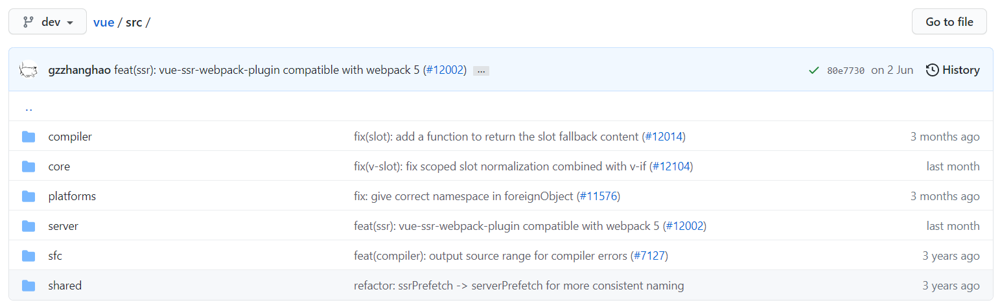
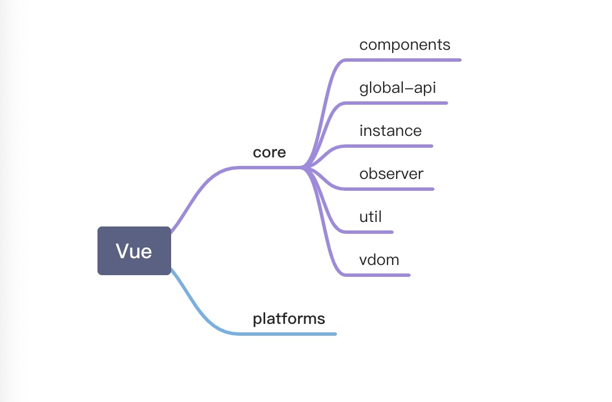
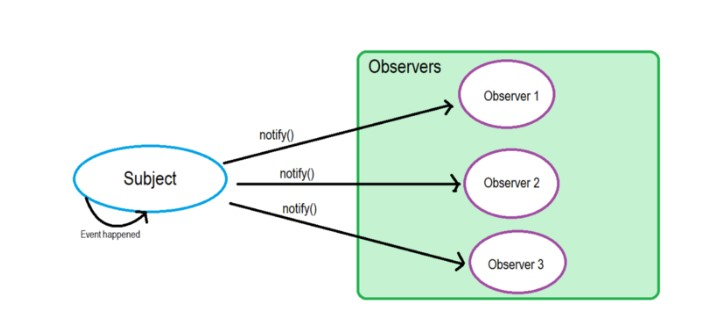
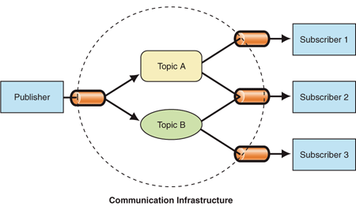
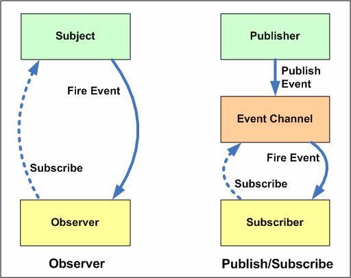
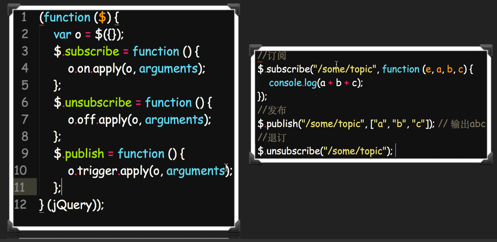
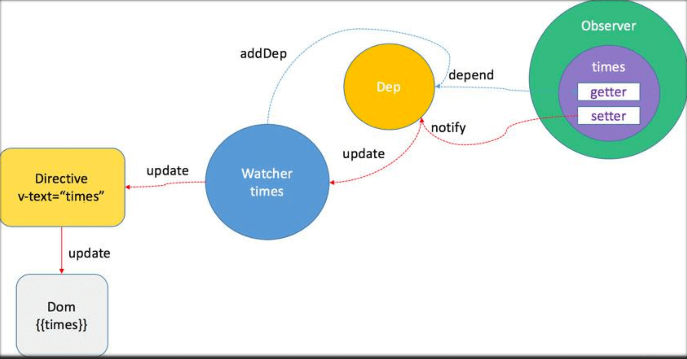

# Vue2源码解析


## Vue架构概览



- /compiler 目录是编译模版；
    - /core 目录是Vue.js 的核心（也是后面的重点）；
    - components 模版编译的代码
    - global-api 最上层的文件接口
    - instance 生命周期 -> init.js
    - observer 数据收集与订阅
    - util 常用工具方法类
    - vdom 虚拟dom
- /platforms 目录是针对核心模块的‘平台’模块；
- /platforms 目录下暂时只有web目录（在最新的开发目录里已经有 weex 目录了）。web 目录下有对应的/compiler、/runtime、/server、/util目录；
- /server 目录是处理服务端渲染；
- /sfc 目录是处理单文件的.vue；
- /shared 目录提供全局用到的工具函数。



结论：Vue.js 的组成是由 core + 对应的 “平台”补充代码构成（独立构件和运行时构建只是platforms 下web平台的两种选择）
## vue运行时(runtime)
vue运行时是一个过程：
- 将数据变成响应式数据；
- 把响应式数据里面的页面写的过程变为虚拟dom;
- 在运行时怎么处理dom diff;
- watcher（数据与dom的关系） 怎么去渲染，怎么保存关联的数据;
## vue编译时(compiler)
template => render(js)

vue最常用的开发过程：
>前端工程化webpack + vue-loader->打包->生成js文件->将静态文件发到服务器->浏览器加载
### 离线编译
前端工程化webpack + vue-loader
>vue-loader 衔接webpack的一些机制，有输入输出
### 在线编译(浏览器运行时)
compiler->在线解析vue模版

[Vue2在线编译][linkRoute]

[linkRoute]: https://vue-template-explorer.netlify.app/#%3Cdiv%20id%3D%22app%22%3E%7B%7B%20msg%20%7D%7D%3C%2Fdiv%3E

```js
<div id="app">
  <div class="box">{{msg}}</div>
  <h1>在线编译模版</h1>
</div>
```
解析后：
```js
function render() {
  with(this) {
    return _c('div', {
      attrs: {
        "id": "app"
      }
    }, [_c('div', {
      staticClass: "box"
    }, [_v(_s(msg))]), _c('h1', [_v("在线编译模版")])])
  }
}
```
Vue2模版编译 => 正则表达式 （有性能问题->回溯）
Vue3模版编译 => 状态机编译机制
.Vue =>（词法分析 -> 语法分析 -> 构建AST -> 转译js） => 输出render
## vue与react区别
1. vue
- 双向数据流
- 编译时优化 + 定向更新
- 离线编译时，静态的分析模版特点，优化生成的js
    - 离线编译的时候如果某一块内容是静态节点，下次编译将不再进行编译
    - 在线编译时，静态节点将不再去解析
- 限定写法
2. react 
- 单向数据流
- 运行时优化 + fiber
## 双向数据绑定
首先来了解下两种软件设计模式
### 软件设计模式
#### 观察者模式（Observer Pattern)
观察者模式定义了对象之间一对多的依赖，当一个对象改变状态时，它的所有依赖者都会收到通知并自动更新。


例如：当你订阅一份报纸，每天都会有一份最新的报纸送到你的手上，有多少人订阅报纸，报社就会发多少报纸。报社和订报纸的客户是一对多的关系。
#### 发布/订阅者模式（Pub-Sub  Pattern）
发布/订阅者模式中，发布者不会直接将消息发送给订阅者，两者不是直接关联的。而是需要一个中间人，称为代理或者消息代理或者事件总线，它过滤所有的消息并相应的分发给他们。是用于不同系统组件之间传递消息的模式，而这些组件并不知道关于彼此身份的任何信息。

#### 两者区别
在Observer模式中，Observer需要知道Subject，同时Subject需要保留Observers的记录。然而，在发布者/订阅者模式中，发布者和订阅者不需要相互了解，他们只是在消息队列或者代理的帮助下进行通信；
在发布者/订阅者模式中，组件是松散耦合的；
观察者模式是以同步的方式实现的，即当某些事件发生时，Subject调用其所有观察者的方法；发布者/订阅者在大多数情况下是异步方式（消息队列）



一个例子：



### 双向绑定（响应式原理）
- Object.defineProperty
- Observer
- Watcher
- Dep
- Directive
#### object.defineProperty
- 作用：重写对象的某一个key值
- 缺点：不能监听新增的key（不管是对象，还是数组）

**数组也是有key值的，它的key值就是索引，可以监听数组**

```js
var obj = {};
var a;
Object.defineProperty(obj, 'a', {
  get:function(){
    console.log('get val')
    return a;
  },
  set: function(val) {
    console.log(val)
    a = val
  }
})
obj.a; 		  // get   <span>{{a}}</span>
obj.a = 123; // set    <input type="text" v-model="a"/>
```
### 流程

- 指令：指定vue具体用来做什么的命令
- 数据与指令的关联
    - 用什么记录 -> dep数组(电话本)
    - 什么时候记录 -> 第一次使用的时候记录
    - 记录什么 -> 记录关系（watcher） 哪个数据 <-> 哪个指令 （电话号码）
    - 通知什么 -> 指令的使用场景
    - 什么时候通知 -> 数据变化的时候
    - 怎么通知 -> 遍历Dep通知
- 流程描述
    - 初始化数据 -> 触发get -> 存watcher（数据跟指令建立关系加到dep数组中）-> 返回数据 -> 更新视图
    - 数据变化 -> 触发set -> 触发存的wathcher（找到dep数组中建立的关系）-> 触发get -> 调用watcher -> 更新视图
- Observer 监听数据
- Dep 收集依赖
- Watcher 数据与指令的关联
## Observer
Observer会观察两种类型的数据，Array 和 Object
对于Array的数据，由于JavaScript的限制，Vue不能检测变化，会先重写操作数组的原型方法，重写达到两个目的：
- 当数组变化时，触发notify
如果是push、unshift、splice 这些添加新元素的操作，则会使用observer观察新添加的数据