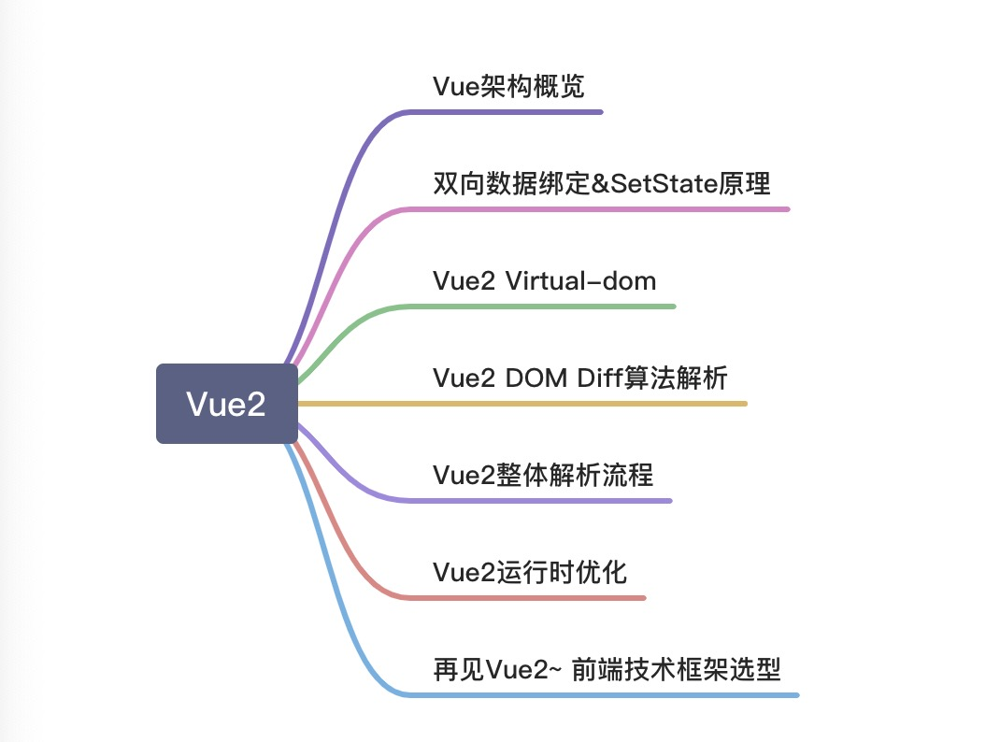

# Vue2源码解析


## Vue架构概览


- /compiler 目录是编译模版；
    - /core 目录是Vue.js 的核心（也是后面的重点）；
    - components 模版编译的代码
    - global-api 最上层的文件接口
    - instance 生命周期 -> init.js
    - observer 数据收集与订阅
    - util 常用工具方法类
    - vdom 虚拟dom
- /platforms 目录是针对核心模块的‘平台’模块；
- /platforms 目录下暂时只有web目录（在最新的开发目录里已经有 weex 目录了）。web 目录下有对应的/compiler、/runtime、/server、/util目录；
- /server 目录是处理服务端渲染；
- /sfc 目录是处理单文件的.vue；
- /shared 目录提供全局用到的工具函数。


结论：Vue.js 的组成是由 core + 对应的 “平台”补充代码构成（独立构件和运行时构建只是platforms 下web平台的两种选择）
## vue运行时(runtime)
vue运行时是一个过程：
- 将数据变成响应式数据；
- 把响应式数据里面的页面写的过程变为虚拟dom;
- 在运行时怎么处理dom diff;
- watcher（数据与dom的关系） 怎么去渲染，怎么保存关联的数据;
## vue编译时(compiler)
template => render(js)

vue最常用的开发过程：
>前端工程化webpack + vue-loader->打包->生成js文件->将静态文件发到服务器->浏览器加载
### 离线编译
前端工程化webpack + vue-loader
>vue-loader 衔接webpack的一些机制，有输入输出
### 在线编译(浏览器运行时)
compiler->在线解析vue模版

[Vue2在线编译][linkRoute]

[linkRoute]: https://vue-template-explorer.netlify.app/#%3Cdiv%20id%3D%22app%22%3E%7B%7B%20msg%20%7D%7D%3C%2Fdiv%3E

```js
<div id="app">
  <div class="box">{{msg}}</div>
  <h1>在线编译模版</h1>
</div>
```
解析后：
```js
function render() {
  with(this) {
    return _c('div', {
      attrs: {
        "id": "app"
      }
    }, [_c('div', {
      staticClass: "box"
    }, [_v(_s(msg))]), _c('h1', [_v("在线编译模版")])])
  }
}
```
Vue2模版编译 => 正则表达式 （有性能问题->回溯）
Vue3模版编译 => 状态机编译机制
.Vue =>（词法分析 -> 语法分析 -> 构建AST -> 转译js） => 输出render
## vue与react区别
1. vue
- 双向数据流
- 编译时优化 + 定向更新
- 离线编译时，静态的分析模版特点，优化生成的js
    - 离线编译的时候如果某一块内容是静态节点，下次编译将不再进行编译
    - 在线编译时，静态节点将不再去解析
- 限定写法
2. react 
- 单向数据流
- 运行时优化 + fiber
## 双向数据绑定
首先来了解下两种软件设计模式
### 软件设计模式
#### 观察者模式（Observer Pattern)
观察者模式定义了对象之间一对多的依赖，当一个对象改变状态时，它的所有依赖者都会收到通知并自动更新。


例如：当你订阅一份报纸，每天都会有一份最新的报纸送到你的手上，有多少人订阅报纸，报社就会发多少报纸。报社和订报纸的客户是一对多的关系。
#### 发布/订阅者模式（Pub-Sub  Pattern）
发布/订阅者模式中，发布者不会直接将消息发送给订阅者，两者不是直接关联的。而是需要一个中间人，称为代理或者消息代理或者事件总线，它过滤所有的消息并相应的分发给他们。是用于不同系统组件之间传递消息的模式，而这些组件并不知道关于彼此身份的任何信息。

#### 两者区别
在Observer模式中，Observer需要知道Subject，同时Subject需要保留Observers的记录。然而，在发布者/订阅者模式中，发布者和订阅者不需要相互了解，他们只是在消息队列或者代理的帮助下进行通信；
在发布者/订阅者模式中，组件是松散耦合的；
观察者模式是以同步的方式实现的，即当某些事件发生时，Subject调用其所有观察者的方法；发布者/订阅者在大多数情况下是异步方式（消息队列）


一个例子：


### 双向绑定（响应式原理）
- Object.defineProperty
- Observer
- Watcher
- Dep
- Directive
#### object.defineProperty
- 作用：重写对象的某一个key值
- 缺点：不能监听新增的key（不管是对象，还是数组）

**数组也是有key值的，它的key值就是索引，可以监听数组**

```js
var obj = {};
var a;
Object.defineProperty(obj, 'a', {
  get:function(){
    console.log('get val')
    return a;
  },
  set: function(val) {
    console.log(val)
    a = val
  }
})
obj.a; 		  // get   <span>{{a}}</span>
obj.a = 123; // set    <input type="text" v-model="a"/>
```
### 流程

- 指令：指定vue具体用来做什么的命令
- 数据与指令的关联
    - 用什么记录 -> dep数组(电话本)
    - 什么时候记录 -> 第一次使用的时候记录
    - 记录什么 -> 记录关系（watcher） 哪个数据 <-> 哪个指令 （电话号码）
    - 通知什么 -> 指令的使用场景
    - 什么时候通知 -> 数据变化的时候
    - 怎么通知 -> 遍历Dep通知
- 流程描述
    - 初始化数据 -> 触发get -> 存watcher（数据跟指令建立关系加到dep数组中）-> 返回数据 -> 更新视图
    - 数据变化 -> 触发set -> 触发存的wathcher（找到dep数组中建立的关系）-> 触发get -> 调用watcher -> 更新视图
- Observer 监听数据
- Dep 收集依赖
- Watcher 数据与指令的关联
## Observer
Observer会观察两种类型的数据，Array 和 Object
对于Array的数据，由于JavaScript的限制，Vue不能检测变化，会先重写操作数组的原型方法，重写达到两个目的：
  - 当数组变化时，触发notify
>如果是push、unshift、splice 这些添加新元素的操作，则会使用observer观察新添加的数据
  - 重写完原型方法后，遍历拿到数组中的每个数据，使用observer观察他

对于Object类型的数据，则遍历它的每一个key，使用Object.defineProperty设置getter和setter，当触发getter的时候，Observer就开始收集依赖，触发setter的时候，observer就notify它。

### array.js
vue重写了数组的方法，数组的变更会频繁的移动位置，频繁的触发get/set，频繁的更新视图


重写Array的源码如下：
```js
/*
 * not type checking this file because flow doesn't play well with
 * dynamically accessing methods on Array prototype
 */

import { def } from '../util/index'

const arrayProto = Array.prototype
export const arrayMethods = Object.create(arrayProto)


const methodsToPatch = [
  'push',
  'pop',
  'shift',
  'unshift',
  'splice',//splice(0,1212)
  'sort',
  'reverse'
]


/**
 * Intercept mutating methods and emit events
 */
methodsToPatch.forEach(function (method) {
  const original = arrayProto[method]


  /**
     Object.defineProperty(obj, key, {
        value: val,
        enumerable: !!enumerable,
        writable: true,
        configurable: true
      })
   */
  def(arrayMethods, method, function mutator(...args) {
    const result = original.apply(this, args)


    const ob = this.__ob__


    let inserted
    switch (method) {
      case 'push':
      case 'unshift':
        inserted = args
        break
      case 'splice':
        inserted = args.slice(2)
        break
    }
     // 如果新增的项是数组，进行递归处理响应数据
    if (inserted) ob.observeArray(inserted)
  // 触发视图更新
    ob.dep.notify();
    return result
  })
})
```
array.js代码执行流程：
1. 重写原型链，重写数组集成的对象
2. 获取到数组的原型对象
3. 创建新对象，继承数组构造方法的原型对象
4. 定义要重写的方法 (push、pop、shift、unshift、splice、sort、reverse)
5. 遍历方法
  - 获取数组最原始的方法
  - 重写对象上的方法名
  - 获取最原始的方法,执行最原始的结果，这样不会影响正确的结果

### index.js
Array入口代码：
```js
constructor(value: any) {
    this.value = value
    this.dep = new Dep();
    this.vmCount = 0
    def(value, '__ob__', this);
    if (Array.isArray(value)) {
      // 无论支不支持__ptoto__，都重写原型链
      if (hasProto) {
        protoAugment(value, arrayMethods)
      } else {
        copyAugment(value, arrayMethods, arrayKeys)
      }
      this.observeArray(value)
    } else {
      this.walk(value)
    }
  }
```
Observer对象的标志是 ob 这个属性，这个属性保存了Observer对象自己本身。对象在转化为Observer的过程是一个递归的过程，对象的子元素如果是对象或者数组的，也会转为Observer对象。

observeArray 方法对数组进行遍历，递归调用observe方法，最终都会走入 walk 方法监控单个元素。
```js
 observeArray(items: Array<any>) {
    for (let i = 0, l = items.length; i < l; i++) {
      observe(items[i])
    }
  }
```
Walk 方法遍历对象，结合defineReactive 方法递归将属性转为getter和setter

Walk方法：
```js
 walk(obj: Object) {
    const keys = Object.keys(obj);
    for (let i = 0; i < keys.length; i++) {
      defineReactive(obj, keys[i])
    }
  }
```
defineReactive方法：
```ts
/**
 * Define a reactive property on an Object.
 */
export function defineReactive(
  obj: Object,
  key: string,
  val: any,
  customSetter?: ?Function,
  shallow?: boolean
) {
  const dep = new Dep()
  const property = Object.getOwnPropertyDescriptor(obj, key)
  if (property && property.configurable === false) {
    return
  }

  // cater for pre-defined getter/setters
  const getter = property && property.get
  const setter = property && property.set
  if ((!getter || setter) && arguments.length === 2) {
    val = obj[key]
  }

  let childOb = !shallow && observe(val)
  Object.defineProperty(obj, key, {
    enumerable: true,
    configurable: true,
    get: function reactiveGetter() {
      const value = getter ? getter.call(obj) : val
      // 收集依赖
      if (Dep.target) {
        dep.depend()
        if (childOb) {
          childOb.dep.depend()
          if (Array.isArray(value)) {
            dependArray(value) // 如果是数组进一步处理
          }
        }
      }
      return value
    },
    set: function reactiveSetter(newVal) {
      const value = getter ? getter.call(obj) : val
      /* eslint-disable no-self-compare */
      if (newVal === value || (newVal !== newVal && value !== value)) {
        return
      }
      /* eslint-enable no-self-compare */
      if (process.env.NODE_ENV !== 'production' && customSetter) {
        customSetter()
      }
      // #7981: for accessor properties without setter
      if (getter && !setter) return
      if (setter) {
        setter.call(obj, newVal)
      } else {
        val = newVal
      }
      childOb = !shallow && observe(newVal) // 对新数据重新observe
      dep.notify(); // 触发set，通知dep进行数据更新，
    }
  })
}
```
dependArray方法：
```js
/**
 * Collect dependencies on array elements when the array is touched, since
 * we cannot intercept array element access like property getters.
 */
function dependArray(value: Array<any>) {
  for (let e, i = 0, l = value.length; i < l; i++) {
    e = value[i]
    e && e.__ob__ && e.__ob__.dep.depend()
    if (Array.isArray(e)) {
      dependArray(e)
    }
  }
}
```
那么我们可以知道(Observer==>object.defineProperty)处理了两种情况：

1. 数组的情况 array， [{},{b:{}}]，判断 array[1].b 是否对象，如果是继续Observer
2. 非数组的情况object， object.keys获取每个对象的key，object.defineProperty(get\set)

这样就可以保证可以为每一个需要属性的添加监听
## Dep
这个方法是在响应式的过程中调用的，用户修改数据触发 setter 函数，函数的最后一行就是调用 dep.notify 去通知订阅者watcher更新视图。
```ts
export default class Dep {
  static target: ?Watcher;
  id: number;
  subs: Array<Watcher>;

  constructor() {
    this.id = uid++
    // 储存Watcher实例的数组
    this.subs = [];
  }
  // 添加方法，添加Watcher到实例上
  addSub(sub: Watcher) {
    this.subs.push(sub)
  }
  // 移除方法，移除某个Watcher
  removeSub(sub: Watcher) {
    remove(this.subs, sub)
  }
  // 添加依赖
  depend() {
    if (Dep.target) {
      //wathcer.appDep(dep)
      Dep.target.addDep(this)
    }
  }
  // 通知订阅者更新视图
  notify() {
    // stabilize the subscriber list first
    const subs = this.subs.slice()
    if (process.env.NODE_ENV !== 'production' && !config.async) {
      // subs aren't sorted in scheduler if not running async
      // we need to sort them now to make sure they fire in correct
      // order
      subs.sort((a, b) => a.id - b.id)
    }
    // 遍历watcher列表，调用update方法进行更新操作
    for (let i = 0, l = subs.length; i < l; i++) {
      subs[i].update()//Watcher
    }
  }
}
// The current target watcher being evaluated.
// This is globally unique because only one watcher
// can be evaluated at a time.
// 重置Dep.target
Dep.target = null
const targetStack = []

export function pushTarget(target: ?Watcher) {
  targetStack.push(target)
  Dep.target = target
}

export function popTarget() {
  targetStack.pop()
  Dep.target = targetStack[targetStack.length - 1]
}
```
## Watcher
Watcher是将模版和Observer对象结合在一起的纽带，Watcher是订阅者模式中的订阅者。

Watcher的两个参数：expOrFn最终会被转化为getter函数，cb是更新时执行的回调。依赖收集的入口就是get函数
```js
constructor(
    vm: Component,
    expOrFn: string | Function,
    cb: Function,
    options?: ?Object,
    isRenderWatcher?: boolean
  ) {
    this.vm = vm
    if (isRenderWatcher) {
      vm._watcher = this
    }
    vm._watchers.push(this) // 将当前的Watcher类推送到对应的Vue实例中
    // options
    if (options) {
      this.deep = !!options.deep
      this.user = !!options.user
      this.lazy = !!options.lazy
      this.sync = !!options.sync
      this.before = options.before
    } else {
      this.deep = this.user = this.lazy = this.sync = false
    }
    this.cb = cb
    this.id = ++uid // uid for batching
    this.active = true
    this.dirty = this.lazy // for lazy watchers
    this.deps = []
    this.newDeps = []
    this.depIds = new Set()
    this.newDepIds = new Set()
    this.expression = process.env.NODE_ENV !== 'production'
      ? expOrFn.toString()
      : ''
    // parse expression for getter
    if (typeof expOrFn === 'function') {
      // 如果是函数，相当于指定了当前订阅者获取数据的方法，每次订阅者通过这个方法获取数据，然后与之前的值进行比对
      this.getter = expOrFn
    } else {
      this.getter = parsePath(expOrFn) // 否则将表达式解析为可执行的函数
      if (!this.getter) {
        this.getter = noop
        process.env.NODE_ENV !== 'production' && warn(
          `Failed watching path: "${expOrFn}" ` +
          'Watcher only accepts simple dot-delimited paths. ' +
          'For full control, use a function instead.',
          vm
        )
      }
    }
    this.value = this.lazy
      ? undefined
      : this.get()  // 如果lazy不为空，则执行get方法收集依赖
  }
```
get函数是用来连接监控属性和watcher的关键
```js
/**
   * Evaluate the getter, and re-collect dependencies.
   */
  get() {
    // 设置全局变量，Dep.target，将watcher保存在这个全局变量中
    pushTarget(this)
    let value
    const vm = this.vm
    try {
      // 调用getter函数，进入get方法，进行依赖收集操作
      value = this.getter.call(vm, vm)
    } catch (e) {
      if (this.user) {
        handleError(e, vm, `getter for watcher "${this.expression}"`)
      } else {
        throw e
      }
    } finally {
      // "touch" every property so they are all tracked as
      // dependencies for deep watching
      if (this.deep) {
        traverse(value)
      }
      popTarget() // 将全局变量Dep.target置为null
      this.cleanupDeps()
    }
    return value
  }
```
只有通过watcher 触发的 getter 会收集依赖，而所谓的被收集的依赖就是当前 watcher.初始化时传入的参数 expOrFn 中涉及到的每一项数据，然后触发该数据项的 getter 函数；getter 函数中就是通过判断 Dep.target 的有无来判断是 Watcher 初始化时调用的还是普通数据读取，如果有则进行依赖收集。
## Directive
