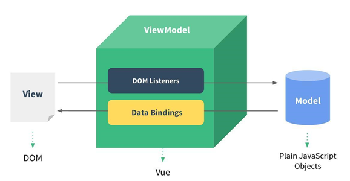

# 基础概念
## 什么是vue
- 一套用于构建用户界面的渐进性框架
- 采用自下向上增量开发的设计
- 核心库只关注视图层，容易上手
- 可采用单文件组件和生态系统支持的库开发复杂的单页应用
## 什么是渐进式框架
先来看下面这张图：

- 声明式渲染
- 组件系统
- 客户端路由 
- 大规模状态管理
- 构建工具
### 渐进式
主张最少，提供足够的选择。可以让我们自由组合。可以只使用vue的声明式渲染，根据业务需要逐步增加其他模块。
### Angualr
- 必须使用它的模块机制
- 必须使用它的注入机制
- 必须使用它的特殊形式的组件
### React
- 函数式编程的理念
## 为什么使用vue
### 声明式渲染
允许采用简洁的模版语法来声明式的将数据渲染进DOM系统
>声明式就是告诉机器你想要的是什么，让机器去想出如何去做
### 响应式数据绑定

- 通过监听View，更新Model
    - v-model 指令可以监听DOM
- 通过数据绑定，更新View
    - {{}}
### 组件化开发
允许我们使用小型、独立和可复用的组件构建大型应用。
- 增强代码的复用能力，使复杂应用代码维护更简单。

### Virtual DOM
预先通过js各种计算，将最终的dom操作计算出来并优化。之所以叫做虚拟，是因为dom操作属于预处理操作，并没有真实的操作dom；在最后计算完毕才将真正的dom操作进行提交，最后将dom操作变化反应到dom树上。
减少dom操作，提升渲染性能
